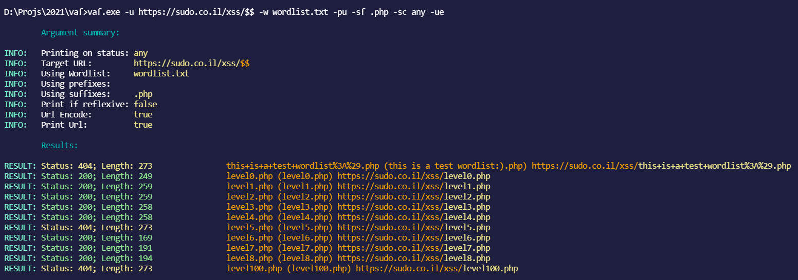
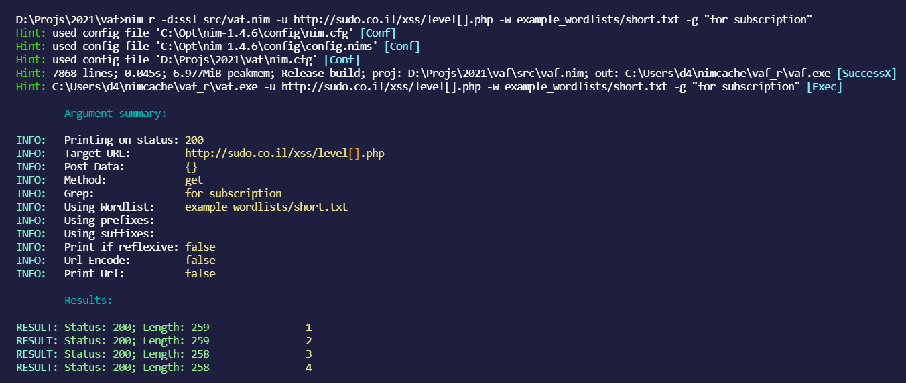

# vaf

[](https://github.com/d4rckh/vaf/issues)
[](https://github.com/d4rckh/vaf/network)
[](https://github.com/d4rckh/vaf/blob/main/LICENSE)


cross-platform very advanced (web) fuzzer 

**features**
- Grep
- Output to a file
- Status code filtering
- Detect reflexivness (useful for finding xss)
- Prefix, suffixes
- Custom wordlists
- Fuzz any part of the url
- POST support
- URL encode payload
- Print requested URL (useful for debugging)
- Much more to come

## compiling

**There will also be a vaf_linux_amd64 binary for linux users already compiled by me, but that's not going to be always updated**

0. Clone and cd into the repo
1. Install nim

Linux: Install nim using: `curl https://nim-lang.org/choosenim/init.sh -sSf | sh` and adding nim to path

Windows: Download nim from https://nim-lang.org/install_windows.html and run `finish.exe` (you might need to reopen a cmd window for nim to load)

2. Run
```bash
nimble build
```
A vaf binary file will be created in your directory ready to be used

## using vaf

using vaf is very simple, here's the current help menu:
```
                     _____ 
      ___  _______ _/ ____\
      \  \/ /\__  \\   __\
       \   /  / __ \|  |
        \_/  (____  /__|
                  \/
                by d4rckh

vaf - very advanced fuzzer

Usage:
  vaf - very advanced fuzzer [options]

Options:
  -h, --help
  -u, --url=URL              choose url, replace area to fuzz with []
  -w, --wordlist=WORDLIST    choose the wordlist to use
  -sc, --status=STATUS       set on which status to print, set this param to 'any' to print on any status (default: 200)
  -pr, --prefix=PREFIX       prefix, e.g. set this to / for content discovery if your url doesnt have a / at the end (default: )  
  -sf, --suffix=SUFFIX       suffix, e.g. use this for extensions if you are doing content discovery (default: )
  -pd, --postdata=POSTDATA   only used if '-m post' is set (default: {})
  -m, --method=METHOD        the method to use post/get, in lowercase, get is default (default: get)
  -g, --grep=GREP            greps for a string in the response (default: )
  -o, --output=OUTPUT        Output the results in a file (default: )
  -pif, --printifreflexive   print only if the output reflected in the page, useful for finding xss
  -ue, --urlencode           url encode the payloads
```

## screenshots


(with every status code printed, suffixes .php,.html and no prefixes)


(with url printed, every status code printed, suffixes .php,.html and no prefixes)


(post data fuzzing)


(grep functionality)

## examples

Fuzz post data:

```
vaf.exe -w example_wordlists\short.txt -u https://jsonplaceholder.typicode.com/posts -m post -sc 201 -pd "{\"title\": \"[]\"}"
```

Fuzz GET URLs

```
vaf.exe -w example_wordlists\short.txt -u https://example.org/[] -sf .html
```

## tips

- Add a trailing `,` in the suffixes or prefixes argument to try the word without any suffix/prefix like this: `-pf .php,` or `-sf .php,`
- Use `-pif` with a bunch of xss payloads as the wordlist to find XSS
- Make an issue if you want to suggest a feature

# contributors 

Thanks to everyone who contributed to this project!
- [@daanbreur](https://github.com/daanbreur)
