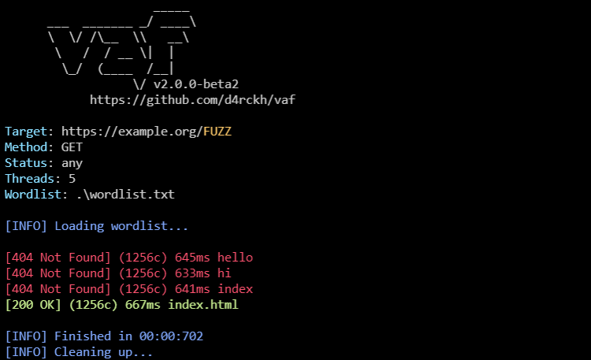

# vaf
very advanced fuzzer

## compiling

1. Install nim from nim-lang.org
2. Run
```bash
nim c -d:ssl vaf.nim
```
## using vaf

using vaf is simple, here's the current help text:
```
Usage:
  vaf - very advanced fuzzer [options]

Options:
  -h, --help
  -u, --url=URL              choose url, replace area to fuzz with $$
  -w, --wordlist=WORDLIST    choose the wordlist to use
  -sc, --status=STATUS       set on which status to print, set this param to 'any' to print on any status (default: 200)
  -pr, --prefix=PREFIX       prefix, e.g. set this to / for content discovery if your url doesnt have a / at the end (default: )
  -sf, --suffix=SUFFIX       suffix, e.g. use this for extensions if you are doing content discovery (default: )
  -pif, --printifreflexive   print only if the output reflected in the page, useful for finding xss
  -ue, --urlencode           url encode the payloads
  -pu, --printurl            prints the url that has been requested
```

## screenshots


(with url printed, encoded output, every status code printed, prefix .php and no suffixes)


(with encoded output, every status code printed, prefix .php and no suffixes)
